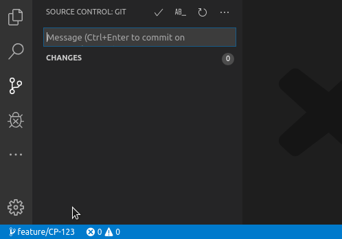

Based in the amazing work from https://github.com/srmeyers/git-prefix and https://github.com/johnie/jira-branch

# Jira / Flow Prefix

## Features

Insert Jira / Git Flow prefix from the current branch name into the Source Control Git Message box.

Button to run `Jira / Flow Branch Prefix Commit Message` command:

## Usage

- Open the Command Palette `Ctrl+Shift+P` (`Cmd+Shift+P` on macOS)
- Type `Jira / Flow Branch Prefix Commit Message` and hit `return`
- The matching branch pattern is prefixed in the Git Message box

## Extension Settings

This extension contributes the following settings using JavaScript regular expression syntax:

* `flowJiraCommitPrefix.pattern`: A regular expression to extract from branch name. Should match entire branch.
* `flowJiraCommitPrefix.replacementEval` : Content to replace in commit message.
* `flowJiraCommitPrefix.replacementExpr` : Content to place in commit message.

**Happy Committing!**
